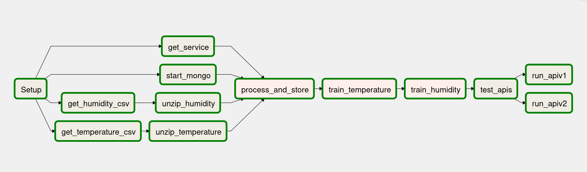

# Practica 2 CCSA:  Despliegue de un servicio Cloud Native
### Introducción

En esta práctica se nos pide desarrollar un flujo de despliegue de un sistema de predicción meteorológica usando Apache Airflow. El flujo de trabajo deberá obtener los datos, procesarlos, almacenarlos en una base de datos, realizar predicciones, pasar los tests y desplegar dos microservicios para poder consultar las predicciones. Las predicciones se consultarán mediante dos APIs REST que devolverán una predicción de temperatura y humedad en la ciudad de San Francisco para 24h, 48h y 72h. Cada API usará un método de predicción distinto.

### Flujo de trabajo desarrollado:

#### Tareas:

* [setup](https://github.com/arturocs/CC2_airflow/blob/7f47a2ad6b29844b3a2a316939dcdbd144ff85c1/dag.py#L93): En esta tarea se borran los posibles archivos generados durante ejecuciones anteriores y se crea el directorio de trabajo.
* [get_humidity_csv](https://github.com/arturocs/CC2_airflow/blob/7f47a2ad6b29844b3a2a316939dcdbd144ff85c1/dag.py#L100): Descarga el archivo comprimido que contiene los datos históricos de humedad de la ciudad de San Francisco. He utilizado wget en lugar de curl, ya que wget suele venir en las instalaciones por defecto de los sistemas Linux.
* [get_temperature_csv](https://github.com/arturocs/CC2_airflow/blob/7f47a2ad6b29844b3a2a316939dcdbd144ff85c1/dag.py#L106): Descarga el archivo comprimido que contiene los datos históricos de las temperaturas de la ciudad de San Francisco. Es una tarea distinta de [get_humidity_csv](https://github.com/arturocs/CC2_airflow/blob/7f47a2ad6b29844b3a2a316939dcdbd144ff85c1/dag.py#L100) para poder paralelizar la descarga.
* [get_service](https://github.com/arturocs/CC2_airflow/blob/7f47a2ad6b29844b3a2a316939dcdbd144ff85c1/dag.py#L113): Descarga los archivos necesarios para el testeo y despliegue de las APIs REST, además los copia al directorio necesario. Previamente limpia el directorio de descarga porque en algunas ocasiones he tenido problemas con archivos repetidos. El proceso o ocurre en paralelo a la de los archivos de datos. 
* [unzip_humidity](https://github.com/arturocs/CC2_airflow/blob/7f47a2ad6b29844b3a2a316939dcdbd144ff85c1/dag.py#L120): Descomprime el archivo CSV de humedad. Las descompresiones ocurren en paralelo.
* [unzip_temperature](https://github.com/arturocs/CC2_airflow/blob/7f47a2ad6b29844b3a2a316939dcdbd144ff85c1/dag.py#L127): Descomprime el archivo CSV de temperaturas. Las descompresiones ocurren en paralelo.
* [start_mongo](https://github.com/arturocs/CC2_airflow/blob/7f47a2ad6b29844b3a2a316939dcdbd144ff85c1/dag.py#L134): Inicializa un contenedor de mongodb utilizando docker para ser utilizado como base de datos durante el flujo de trabajo. Previamente para la ejecución de los contenedores para evitar problemas. He usado mongo ya que su enfoque basado en documentos permite introducir guardar datos en formato diccionario. 
* [process_and_store](https://github.com/arturocs/CC2_airflow/blob/7f47a2ad6b29844b3a2a316939dcdbd144ff85c1/dag.py#L141): Llama a la función [process_and_store()](https://github.com/arturocs/CC2_airflow/blob/7f47a2ad6b29844b3a2a316939dcdbd144ff85c1/dag.py#L26) que pre-procesa los archivos de datos previamente descomprimidos para crear un diccionario que contiene la temperatura y humedad asociadas a cada fecha, posteriormente establece una conexión con mongodb para guardar dicho diccionario.
* [train_temperature](https://github.com/arturocs/CC2_airflow/blob/7f47a2ad6b29844b3a2a316939dcdbd144ff85c1/dag.py#L148) y [train_humidity](https://github.com/arturocs/CC2_airflow/blob/7f47a2ad6b29844b3a2a316939dcdbd144ff85c1/dag.py#L155): Estas dos tareas extraen los datos de mongo y entrenan un modelo ARIMA para predecir la temperatura y la humedad respectivamente. Inicialmente pensaba incluir el entrenamiento en el microservicio utilizando el decorador `@app.before_first_request` de Flask. Pero para mi sorpresa una función que utiliza dicho decorador no es ejecutada durante el inicio del la aplicación si no tras la primera petición REST. Esto causaba que la primera petición fuese demasiado lenta y devolviera un timeout. Como solución a este problema he usado la librería pickle para volcar los modelos ARIMA a un archivo y posteriormente leerlos durante la ejecución del microservicio. Así que terminé creando dos tareas que extraen los datos necesarios de mongo, entrenan el modelo correspondiente con dichos datos y lo vuelcan a un archivo `.pkl`. Estas dos tareas podrán ejecutarse en paralelo sin ningún problema, pero el proceso de entrenamiento consume grandes cantidades de memoria RAM, por lo que si ambas tareas se ejecutasen a la vez el consumo podría llegar a ser problemático en mi ordenador. Es por esto que he tenido hacer que se ejecuten secuencialmente.
* [test_apis](https://github.com/arturocs/CC2_airflow/blob/7f47a2ad6b29844b3a2a316939dcdbd144ff85c1/dag.py#L162): Esta tarea utiliza pytest y unittest para testear el buen funcionamiento de las APIs REST.
* [run_apiv1](https://github.com/arturocs/CC2_airflow/blob/7f47a2ad6b29844b3a2a316939dcdbd144ff85c1/dag.py#L170): Esta tarea crea una imagen docker del microservicio de la [APIv1](https://github.com/arturocs/CC2_airflow/blob/master/services/APIv1.py), para ello hace uso de [este dockerfile](https://github.com/arturocs/CC2_airflow/blob/master/services/APIv1.dockerfile). Cuando termina el proceso de creación de la imagen inicia un contenedor de dicha imagen. La función [predict()](https://github.com/arturocs/CC2_airflow/blob/7f47a2ad6b29844b3a2a316939dcdbd144ff85c1/services/APIv1.py#L12) carga los archivps `.pkl` de los modelos ARIMA y con ellos realiza una predicción meteorológica.Para la API he utilizado Flask, ya que es una de las formas mas sencillas de crear una API REST. 
* [run_apiv2](https://github.com/arturocs/CC2_airflow/blob/7f47a2ad6b29844b3a2a316939dcdbd144ff85c1/dag.py#L177): Esta tarea crea una imagen docker del microservicio de la [APIv2](https://github.com/arturocs/CC2_airflow/blob/master/services/APIv2.py), para ello hace uso de [este dockerfile](https://github.com/arturocs/CC2_airflow/blob/master/services/APIv2.dockerfile). Esta segunda versión de la API realiza una consulta a una API de predicciones meteorológicas ya existente, filtra los datos de la respuesta y los reenvía al usuario con el formato adecuado.  Me he decantado por la API de predicciones meteorológicas [weatherapi.com](weatherapi.com), ya que a diferencia de [openweathermap.org](openweathermap.org) permite especificar nombres de ciudades. 

### Conclusiones

La herramienta Apache Airflow me ha parecido muy interesante, aunque su uso me ha resultado un tanto tosco y lento, ya que cada vez que el DAG es actualizado hay que esperar un rato, además me he encontrado con problemas cuya solución ha requerido ajustes extraños como borrar varias veces el mismo archivo. Al buscar en Google estos problemas parece que se trata de bugs del propio Airflow, por lo que parece ser que la herramienta aun requiere cierto pulido. 